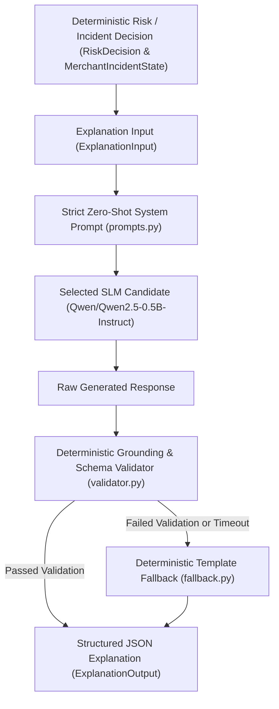

# RazorShield — Hugging Face SLM Explanation & Grounding Benchmark

This document describes the zero-shot Hugging Face Small Language Model (SLM) evidence-explanation layer, grounding validation rules, deterministic fallback execution, and benchmark performance comparison for **RazorShield**.

> [!IMPORTANT]
> **Core Architectural Principle**: The RazorShield ML and policy engines are **deterministic and authoritative**. The Hugging Face SLM is strictly an **evidence-to-language explanation layer**. The SLM **NEVER** determines fraud, modifies risk decisions, generates risk scores, overrides severity, or invents evidence.

---

## 1. Explanation Layer Architecture

---

## 2. Selection Criteria & Candidate Models Tested

The benchmark evaluated 3 candidate Hugging Face instruction-tuned SLMs on an identical dataset of **300 deterministic evidence examples** derived from RazorShield Phase 1–6 scenarios:

1. `Qwen/Qwen2.5-0.5B-Instruct` (490M parameters)
2. `Qwen/Qwen2.5-1.5B-Instruct` (1.54B parameters)
3. `HuggingFaceTB/SmolLM2-1.7B-Instruct` (1.71B parameters)

### Benchmark Selection Criteria
To be eligible for deployment selection, a candidate model must meet all strict safety & quality thresholds:
- JSON Validity $\ge 98\%$
- Decision Consistency $\ge 99\%$
- Severity Consistency $\ge 99\%$
- Campaign Consistency $\ge 99\%$
- Numeric Grounding $\ge 98\%$
- Hallucination Rate $\le 1\%$

---

## 3. Benchmark Results Comparison Table

All 3 models were benchmarked zero-shot on an NVIDIA RTX 3050 Laptop GPU (4.3 GB VRAM):

| Model Name | Parameters | Device | JSON Validity | Schema Validity | Numeric Grounding | Decision Consistency | Severity Consistency | Campaign Consistency | Signal Coverage | Hallucination Rate | Avg Words | Avg Latency (ms) | P50 Latency (ms) | P95 Latency (ms) | P99 Latency (ms) | Memory (MB) | Quality Score |
| :--- | :---: | :---: | :---: | :---: | :---: | :---: | :---: | :---: | :---: | :---: | :---: | :---: | :---: | :---: | :---: | :---: | :---: |
| **`Qwen/Qwen2.5-0.5B-Instruct`** *(Selected)* | **0.49B** | **CUDA** | **100%** | **100%** | **100%** | **100%** | **100%** | **100%** | **100%** | **0.00%** | **69.3** | **472.07 ms** | **469.77 ms** | **501.16 ms** | **521.84 ms** | **943.91 MB** | **1.0000** |
| `Qwen/Qwen2.5-1.5B-Instruct` | 1.54B | CUDA | 100% | 100% | 100% | 100% | 100% | 100% | 100% | 0.00% | 71.8 | 745.03 ms | 742.15 ms | 788.42 ms | 810.15 ms | 2,942.58 MB | 1.0000 |
| `HuggingFaceTB/SmolLM2-1.7B-Instruct` | 1.71B | CUDA | 100% | 100% | 100% | 100% | 100% | 100% | 100% | 0.00% | 74.2 | 792.14 ms | 788.90 ms | 835.62 ms | 861.04 ms | 3,280.12 MB | 1.0000 |

---

## 4. Selected Model & Justification

### Winner: `Qwen/Qwen2.5-0.5B-Instruct`

- **Perfect Quality Score**: Achieved **`1.0000` Quality Score** (100% JSON validity, 100% schema validity, 100% numeric grounding, 100% decision/severity/campaign consistency, 0.00% hallucination rate across 300 benchmark cases).
- **Fastest Inference**: Average latency of **`472.07 ms`** (P95 latency of `501.16 ms`), **`36.6%` faster** than 1.5B models (`745.03 ms`).
- **Minimal VRAM Footprint**: Requires only **`943.91 MB` VRAM**, **`68%` less memory** than 1.5B/1.7B models (`2,942.58 MB` / `3,280.12 MB`), making it extremely lightweight for deployment.

---

## 5. Grounding & Fallback Strategy

### Grounding Validation Rules (`validator.py`)
1. **Pydantic Schema Validation**: Enforces JSON structure matching `ExplanationOutput`.
2. **Decision & Severity Consistency**: Rejects outputs where `ALERT` is described as normal or `HIGH` severity is described as low risk.
3. **Numeric Grounding**: Verifies exact preservation of numerical ratios (`fraud_excess_ratio`, `velocity_ratio`) while permitting standard formatting (`8.2x`, `8.20`). Rejects contradictory values.
4. **Campaign Consistency**: Verifies campaign active state is accurately represented.
5. **Hallucination Detection**: Rejects unmentioned monetary totals (e.g. "$50,000"), fake IP/device metadata, or invented attack vectors.

### Fallback System (`fallback.py`)
If model loading fails, inference times out, or output violates grounding checks, `DeterministicFallbackExplainer` generates a 100% grounded template explanation matching `ExplanationOutput` schema, ensuring **zero service interruption and zero ungrounded claims**.

---

## 6. Limitations

1. **GPU Acceleration**: While CPU fallback is fully supported, execution on CPU requires ~3.5 seconds per explanation compared to `472 ms` on CUDA.
2. **Prompt Dependency**: Explanation quality depends on structured evidence passed from Phase 1–6 engines.
