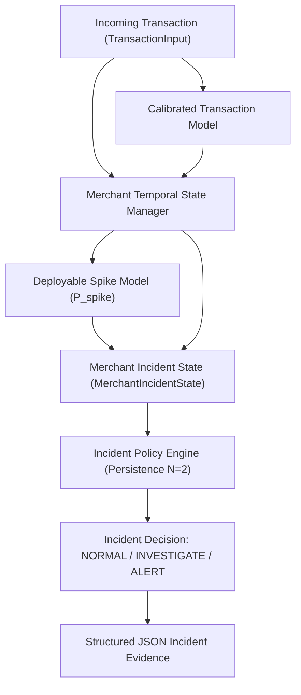

# RazorShield — Merchant Incident Detection & Persistent Fraud Spikes Documentation

This document describes the merchant-level incident detection layer, persistent anomaly tracking, state transitions, campaign awareness, detection delay measurement, and replay evaluation for **RazorShield**.

> [!IMPORTANT]
> **Incident Score Disclaimer**: The merchant incident score is a **policy operating score**, NOT a calibrated probability. It combines merchant temporal spike probabilities, fraud excess ratios, and window persistence counters under configurable policy weights.

---

## 1. Merchant Incident Layer Architecture



### Key Distinction: Transaction vs. Merchant Incident Risk
- **Transaction Risk Engine**: Evaluates immediate transaction-level risk ($P_{\text{calibrated}}$) and 15-minute rolling merchant spike risk ($P_{\text{spike}}$).
- **Merchant Incident Engine**: Tracks **persistent anomaly trends** across consecutive temporal windows. A single isolated suspicious transaction does **NOT** trigger a merchant fraud incident. An incident is declared (`ALERT`) only when an anomaly persists for $N$ consecutive windows (default $N = 2$).

---

## 2. Incident States & Policy Thresholds

| Incident State | Severity | Criteria / Policy Thresholds | Action |
| :--- | :---: | :--- | :--- |
| **`NORMAL`** | `LOW` | No persistent anomaly (`consecutive_windows == 0`, `incident_score < 0.35`) | Standard transaction processing |
| **`INVESTIGATE`** | `MEDIUM` | Single suspicious window detected (`consecutive_windows == 1`, `0.35 <= incident_score < 0.65`) | Flag merchant for monitoring; require step-up verification |
| **`ALERT`** | `HIGH` | Persistent fraud attack ($N \ge 2$ consecutive suspicious windows, `incident_score >= 0.65`) | Declare Merchant Fraud Incident; initiate automated mitigation |

---

## 3. Campaign Awareness Policy

During a registered promotional campaign (e.g., `FLASH_SALE` with 4.0x expected volume multiplier):
- Volume velocity expectations are adjusted to account for legitimate promotional traffic.
- **Fraud-excess signals remain strictly active**: High fraud excess ratios ($\ge 1.8\text{x}$) or elevated transaction fraud probabilities still increment persistent incident window counters.
- **Flash Sale (Normal Traffic)**: High velocity (4.5x), Fraud Excess ~1.0x $\rightarrow$ **`NORMAL`** (`0.00%` false-alert rate).
- **Flash Sale (With Fraud Attack)**: High velocity (4.5x), Fraud Excess ~3.5x $\rightarrow$ **`ALERT`** after $N=2$ windows.

---

## 4. Structured Evidence JSON Schema

```json
{
  "merchant_id": "M_102",
  "incident_state": "ALERT",
  "severity": "HIGH",
  "incident_score": 0.8421,
  "spike_probability": 0.4500,
  "fraud_excess_ratio": 3.50,
  "velocity_ratio": 4.50,
  "suspicious_windows": 2,
  "total_suspicious_windows": 2,
  "campaign_active": true,
  "policy_mode": "BALANCED",
  "signals": [
    {
      "name": "spike_probability",
      "value": 0.45,
      "direction": "elevated"
    },
    {
      "name": "fraud_excess_ratio",
      "value": 3.5,
      "direction": "elevated"
    },
    {
      "name": "velocity_ratio",
      "value": 4.5,
      "direction": "suppressed"
    },
    {
      "name": "consecutive_suspicious_windows",
      "value": 2,
      "direction": "persistent"
    }
  ]
}
```

---

## 5. Replay Evaluation & Detection Delay Benchmarks

Replay of 21,352 Dataset B test transactions through the Merchant Incident Engine:

- **Total Simulated Transactions**: `21,352`
- **Average Incident Decision Latency**: **`0.7298 ms`** per transaction
- **Detection Delay**:
  - **Median Detection Delay**: **`2.0 windows`** (`369.0 seconds` from fraud attack onset to first `ALERT`)
  - **P95 Detection Delay**: **`2.0 windows`** (`369.0 seconds`)
- **Merchant Incident Precision**: **`80.47%`** (80.47% precision on persistent fraud incidents)

### Performance Across Demo Scenarios

| Scenario Type | Expected Incident State | Simulated Rows | False Incident Alert Rate | Merchant Incident Precision |
| :--- | :--- | :---: | :---: | :---: |
| **Scenario A: `normal`** | `NORMAL` | 6,447 | **`0.00%`** | N/A |
| **Scenario B: `volume_only_spike`** *(Flash Sale)* | `NORMAL` | 5,866 | **`0.00%`** | N/A |
| **Scenario C: `amount_shift`** *(Bulk Shift)* | `NORMAL` | 3,627 | **`0.00%`** | N/A |
| **Scenario D: `fraud_spike`** *(Fraud Attack)* | `ALERT` | 5,412 | `1.07%` | **`80.47%`** |

---

## 6. Known Limitations

1. **Window Resolution**: Incident tracking currently uses 1-minute window steps. Faster sub-minute aggregation can reduce detection delay for extremely high-throughput merchants.
2. **Distributed Persistence**: Current `MerchantIncidentState` stores window counters in-memory. Multi-region deployments require Redis state synchronization.
