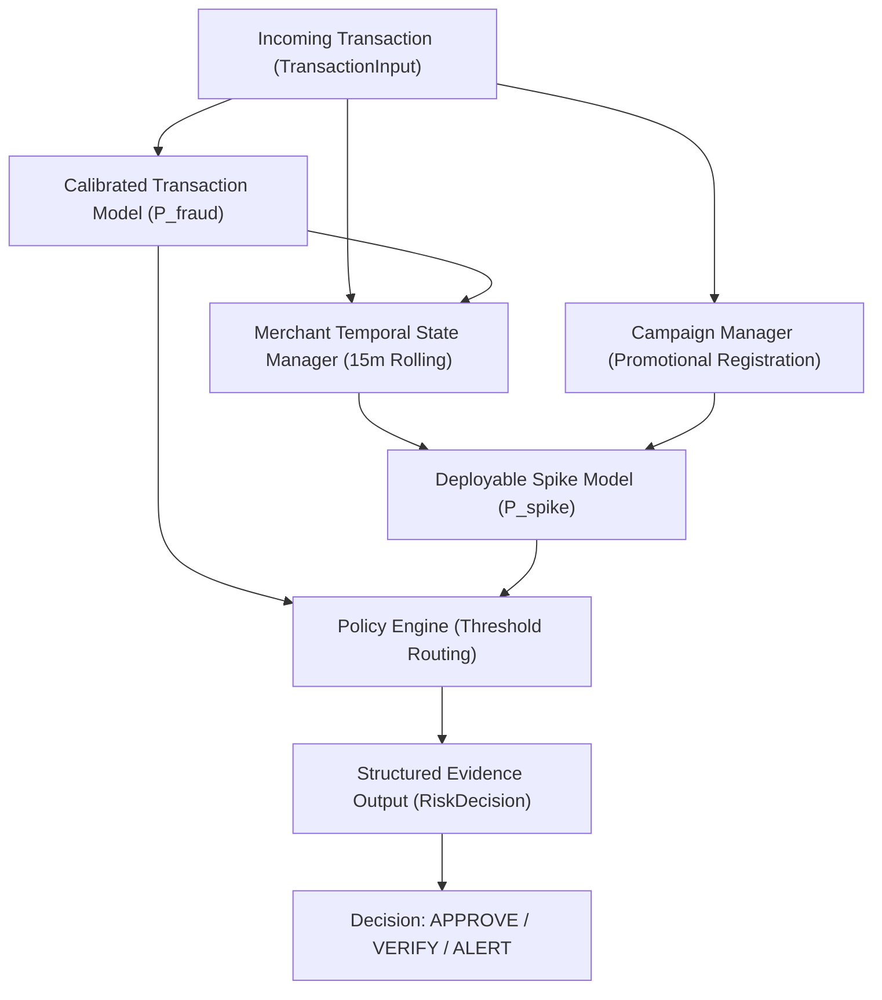

# RazorShield — Risk Decision Engine & Real-Time Simulation Architecture

This document describes the real-time deterministic risk decision engine, merchant rolling temporal state management, policy modes, campaign awareness, structured evidence schemas, and simulation test benchmarks for **RazorShield**.

> [!IMPORTANT]
> **Policy Score Disclaimer**: The combined risk score produced by the decision engine is a **policy operating score**, NOT a statistically calibrated probability. It combines calibrated transaction-level fraud probabilities with merchant-level temporal spike probabilities under policy weights.

---

## 1. Risk Decision Engine Architecture



### Components
1. **Calibrated Transaction Model**: Loads pre-trained IEEE-CIS XGBoost model with Isotonic probability calibration outputting $P(\text{fraud} \mid \text{transaction}) \in [0.0, 1.0]$.
2. **Merchant Temporal State Manager (`MerchantStateManager`)**: Chronologically tracks per-merchant 15-minute rolling volume, fraud estimates, and baseline window stats.
3. **Deployable Spike Model**: Evaluates 14 deployable fraud-excess features (strictly excluding ground-truth oracle features).
4. **Campaign Manager (`CampaignManager`)**: Registers promotional events (e.g. `FLASH_SALE`). Dampens volume anomaly weights while **preserving fraud-excess evidence**.
5. **Policy Engine (`PolicyEngine`)**: Computes combined risk score and routes actions (`APPROVE`, `VERIFY`, `ALERT`) with structured explainability signals.

---

## 2. Policy Modes & Threshold Routing

The Policy Engine supports 3 configurable operating modes:

| Mode | Verify Threshold ($T_{\text{verify}}$) | Alert Threshold ($T_{\text{alert}}$) | Txn Weight ($w_{\text{txn}}$) | Spike Weight ($w_{\text{spike}}$) | Description |
| :--- | :---: | :---: | :---: | :---: | :--- |
| **`CONSERVATIVE`** | `0.10` | `0.30` | `0.50` | `0.50` | Low thresholds for early verification & loss prevention |
| **`BALANCED` (Default)** | `0.20` | `0.50` | `0.50` | `0.50` | Balanced operating mode derived from Phase 4 validation |
| **`HIGH_SENSITIVITY`** | `0.05` | `0.15` | `0.40` | `0.60` | Ultra-sensitive monitoring prioritizing spike recall |

### Action Routing
- `combined_risk_score < T_verify` $\rightarrow$ **`APPROVE`** (`LOW` severity)
- `T_verify <= combined_risk_score < T_alert` $\rightarrow$ **`VERIFY`** (`MEDIUM` severity)
- `combined_risk_score >= T_alert` $\rightarrow$ **`ALERT`** (`HIGH` severity)

---

## 3. Campaign Awareness Policy

During a registered merchant campaign (e.g. `FLASH_SALE` with 4.5x expected volume multiplier):
- Volume velocity expectations are normalized by the expected multiplier.
- **Fraud-excess signals remain active**: If transaction fraud probability or `fraud_excess_ratio` surges, the decision engine still routes to `VERIFY` or `ALERT`.
- **Flash Sale (No Fraud)**: Volume 4.5x, Fraud Excess ~1.0x $\rightarrow$ **`APPROVE`**.
- **Flash Sale (With Fraud Attack)**: Volume 4.5x, Fraud Excess 8.0x $\rightarrow$ **`ALERT`**.

---

## 4. Structured Evidence Schema (`RiskDecision`)

The decision engine outputs machine-readable structured evidence for downstream SLM/LLM explanation modules:

```json
{
  "transaction_id": "TX_994182",
  "merchant_id": "M_102",
  "event_time": "2018-05-15T14:22:00",
  "calibrated_fraud_probability": 0.8124,
  "spike_probability": 0.8841,
  "combined_risk_score": 0.8483,
  "decision": "ALERT",
  "severity": "HIGH",
  "signals": [
    {
      "name": "calibrated_fraud_probability",
      "value": 0.8124,
      "direction": "elevated"
    },
    {
      "name": "fraud_excess_ratio",
      "value": 8.24,
      "direction": "elevated"
    },
    {
      "name": "velocity_ratio",
      "value": 4.50,
      "direction": "suppressed"
    }
  ],
  "campaign_active": true,
  "policy_mode": "BALANCED"
}
```

---

## 5. Test-Set Replay Simulation Benchmark

Replay of 21,352 Dataset B test transactions chronologically:

- **Total Simulated Transactions**: `21,352`
- **Average Execution Latency**: **`0.619 ms`** per transaction
- **P99 Execution Latency**: **`2.2999 ms`** per transaction

### Performance Across Demo Scenarios

| Scenario Type | Expected Behavior | Simulated Transactions | False Alert Rate | Fraud Spike Precision | Fraud Spike Recall |
| :--- | :--- | :---: | :---: | :---: | :---: |
| **`normal`** | Mostly `APPROVE` | 6,447 | **`0.00%`** | N/A | N/A |
| **`volume_only_spike`** *(Flash Sale)* | Minimal Alerts | 5,866 | **`0.00%`** | N/A | N/A |
| **`amount_shift`** *(Bulk Shift)* | Minimal Alerts | 3,627 | **`0.00%`** | N/A | N/A |
| **`fraud_spike`** *(Fraud Attack)* | `VERIFY` / `ALERT` | 5,412 | `1.03%` | **`92.65%`** | **`29.75%`** |

---

## 6. Known Limitations

1. **State Persistence**: Current `MerchantStateManager` stores rolling state in-memory. High-availability streaming requires Redis or a distributed feature store.
2. **Dynamic Campaign Window Extents**: Campaign windows rely on registered start/end timestamps.
